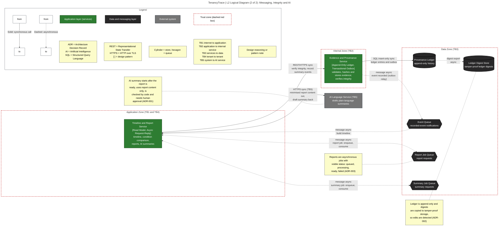

# L2 Logical Diagram (2 of 2): Messaging, Integrity and AI

```mermaid
---
title: "TenancyTrace | L2 Logical Diagram (2 of 2): Messaging, Integrity and AI"
config:
  themeVariables:
    fontFamily: Arial
---
flowchart LR
    subgraph APPZ["Application Zone (TB1 and TB4)"]
        TL["Timeline and Report Service<br/>[Read Model, Async Request-Reply]<br/>timeline, condition comparison,<br/>reports, AI summaries"]:::app
    end

    subgraph INTZ["Internal Zone (TB2)"]
        EV["Evidence and Provenance Service<br/>[Append-Only Ledger, Transactional Outbox]<br/>validates, hashes and stores evidence;<br/>verifies integrity"]:::app
    end

    subgraph DATZ["Data Zone (TB3)"]
        LEDGER[("Provenance Ledger<br/>append-only history")]:::data
        DIGEST[("Ledger Digest Store<br/>tamper-proof ledger digests")]:::data
        EVQ{{"Event Queue<br/>recorded-event notifications"}}:::data
        RJQ{{"Report Job Queue<br/>report requests"}}:::data
        SJQ{{"Summary Job Queue<br/>summary requests"}}:::data
    end

    AIS["AI Language Service (TB5)<br/>drafts plain-language summaries"]:::ext

    TL -->|"REST/HTTPS sync<br/>verify integrity, record summary events"| EV
    EV -->|"SQL insert-only sync<br/>ledger entries and outbox"| LEDGER
    LEDGER -.->|"digest export<br/>async"| DIGEST
    EV -.->|"message async<br/>event recorded (outbox relay)"| EVQ
    EVQ -.->|"message async<br/>build timeline"| TL
    TL <-.->|"message async<br/>report job: enqueue, consume"| RJQ
    TL <-.->|"message async<br/>summary job: enqueue, consume"| SJQ
    TL <-->|"HTTPS sync (TB5)<br/>minimised report content out,<br/>draft summary back"| AIS

    N3["Ledger is append-only and digests<br/>are copied to tamper-proof storage,<br/>so edits are detected (ADR-002)"]:::note
    N4["Reports are asynchronous jobs with<br/>visible status: queued, processing,<br/>ready, failed (ADR-003)"]:::note
    N5["AI summary starts after the report is<br/>ready, uses report content only, is<br/>checked by code and needs human<br/>approval (ADR-001)"]:::note
    N3 -.- DIGEST
    N4 -.- RJQ
    N5 -.- AIS

    subgraph LEG["Legend"]
        direction TB
        K1["Application layer (services)"]:::app
        K2["Data and messaging layer"]:::data
        K3["External system"]:::ext
        K4["Trust zone (dashed red box)"]:::bnd
        K5["Design reasoning or pattern note"]:::note
        K7["from"]:::smp -->|"Solid: synchronous call"| K8["to"]:::smp
        K9["from"]:::smp -.->|"Dashed: asynchronous"| K10["to"]:::smp
        A1["ADR = Architecture Decision Record<br/>AI = Artificial Intelligence<br/>SQL = Structured Query Language"]:::note
        A2["REST = Representational State Transfer<br/>HTTPS = HTTP over TLS<br/>[ ] = design pattern"]:::note
        A3["Cylinder = store, hexagon = queue"]:::note
        A4["TB1 internet to application<br/>TB2 application to internal service<br/>TB3 services to data<br/>TB4 tenant to tenant<br/>TB5 system to AI service"]:::note
        K1 ~~~ A1
        K2 ~~~ A2
        K3 ~~~ A3
        K4 ~~~ A4
    end

    classDef app fill:#2E7D32,stroke:#1b4d1f,stroke-width:2px,color:#FFFFFF
    classDef data fill:#282728,stroke:#000000,stroke-width:2px,color:#FFFFFF
    classDef ext fill:#757575,stroke:#3a414a,stroke-width:2px,color:#FFFFFF
    classDef note fill:#fcfcca,stroke:#3a414a,color:#000000
    classDef bnd fill:#FFFFFF,stroke:#C62828,stroke-width:2px,stroke-dasharray:6 4,color:#000000
    classDef smp fill:#FFFFFF,stroke:#3a414a,color:#000000
    style APPZ fill:#FFFFFF,stroke:#C62828,stroke-width:2px,stroke-dasharray:6 4
    style INTZ fill:#FFFFFF,stroke:#C62828,stroke-width:2px,stroke-dasharray:6 4
    style DATZ fill:#FFFFFF,stroke:#C62828,stroke-width:2px,stroke-dasharray:6 4
    style LEG fill:#FFFFFF,stroke:#3a414a,stroke-width:1px
```
