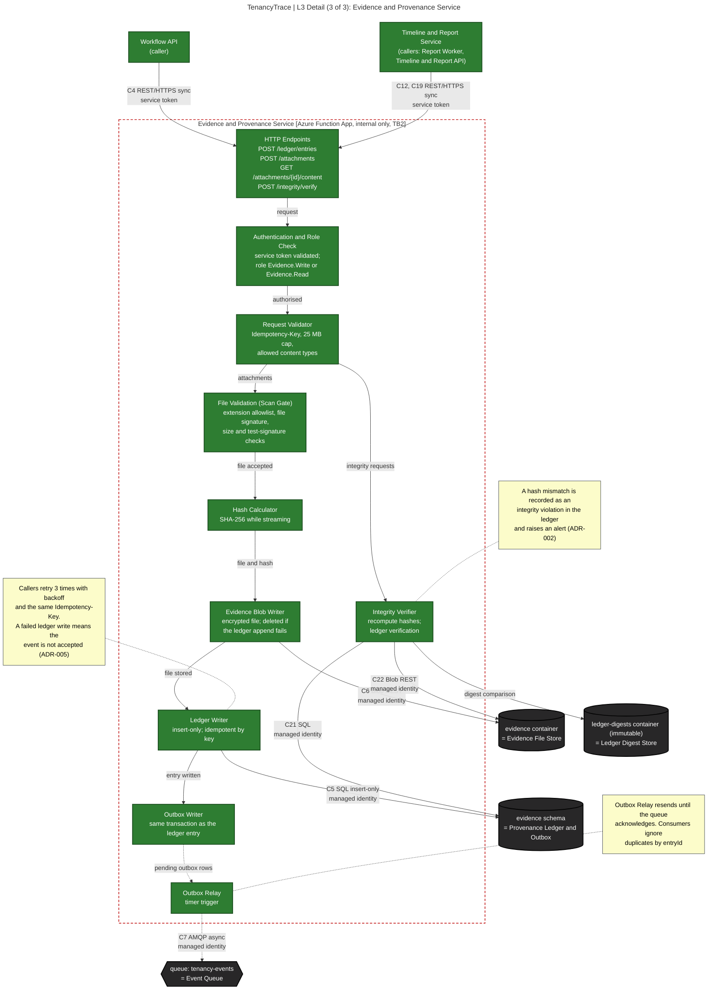

# L3 Detail (3 of 3): Evidence and Provenance Service

```mermaid
---
title: "TenancyTrace | L3 Detail (3 of 3): Evidence and Provenance Service"
config:
  themeVariables:
    fontFamily: Arial
---
flowchart TB
    WAPI["Workflow API<br/>(caller)"]:::app
    TAPI["Timeline and Report Service<br/>(callers: Report Worker,<br/>Timeline and Report API)"]:::app

    subgraph FE["Evidence and Provenance Service [Azure Function App, internal only, TB2]"]
        M1["HTTP Endpoints<br/>POST /ledger/entries<br/>POST /attachments<br/>GET /attachments/{id}/content<br/>POST /integrity/verify"]:::app
        M2["Authentication and Role Check<br/>service token validated;<br/>role Evidence.Write or Evidence.Read"]:::app
        M3["Request Validator<br/>Idempotency-Key, 25 MB cap,<br/>allowed content types"]:::app
        M4["File Validation (Scan Gate)<br/>extension allowlist, file signature,<br/>size and test-signature checks"]:::app
        M5["Hash Calculator<br/>SHA-256 while streaming"]:::app
        M6["Evidence Blob Writer<br/>encrypted file; deleted if<br/>the ledger append fails"]:::app
        M7["Ledger Writer<br/>insert-only; idempotent by key"]:::app
        M8["Outbox Writer<br/>same transaction as the ledger entry"]:::app
        M9["Outbox Relay<br/>timer trigger"]:::app
        M10["Integrity Verifier<br/>recompute hashes;<br/>ledger verification"]:::app
        M1 -->|"request"| M2
        M2 -->|"authorised"| M3
        M3 -->|"attachments"| M4
        M4 -->|"file accepted"| M5
        M5 -->|"file and hash"| M6
        M6 -->|"file stored"| M7
        M7 -->|"entry written"| M8
        M8 -.->|"pending outbox rows"| M9
        M3 -->|"integrity requests"| M10
    end

    BEV[("evidence container<br/>= Evidence File Store")]:::data
    SEV[("evidence schema<br/>= Provenance Ledger and Outbox")]:::data
    BDG[("ledger-digests container (immutable)<br/>= Ledger Digest Store")]:::data
    Q1{{"queue: tenancy-events<br/>= Event Queue"}}:::data

    WAPI -->|"C4 REST/HTTPS sync<br/>service token"| M1
    TAPI -->|"C12, C19 REST/HTTPS sync<br/>service token"| M1
    M6 -->|"C6 Blob REST<br/>managed identity"| BEV
    M7 -->|"C5 SQL insert-only<br/>managed identity"| SEV
    M9 -.->|"C7 AMQP async<br/>managed identity"| Q1
    M10 -->|"C22 Blob REST<br/>managed identity"| BEV
    M10 -->|"C21 SQL<br/>managed identity"| SEV
    M10 -->|"digest comparison"| BDG

    N1["Callers retry 3 times with backoff<br/>and the same Idempotency-Key.<br/>A failed ledger write means the<br/>event is not accepted (ADR-005)"]:::note
    N2["Outbox Relay resends until the queue<br/>acknowledges. Consumers ignore<br/>duplicates by entryId"]:::note
    N3["A hash mismatch is recorded as an<br/>integrity violation in the ledger<br/>and raises an alert (ADR-002)"]:::note
    N1 -.- M7
    N2 -.- M9
    N3 -.- M10

    classDef app fill:#2E7D32,stroke:#1b4d1f,stroke-width:2px,color:#FFFFFF
    classDef data fill:#282728,stroke:#000000,stroke-width:2px,color:#FFFFFF
    classDef note fill:#fcfcca,stroke:#3a414a,color:#000000
    classDef bnd fill:#FFFFFF,stroke:#C62828,stroke-width:2px,stroke-dasharray:6 4,color:#000000
    classDef smp fill:#FFFFFF,stroke:#3a414a,color:#000000
    style FE fill:#FFFFFF,stroke:#C62828,stroke-width:2px,stroke-dasharray:6 4
```
