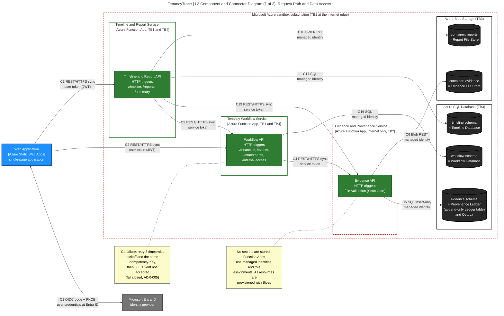

# L3 Component and Connector Diagram (1 of 3): Request Path and Data Access

```mermaid
---
title: "TenancyTrace | L3 Component and Connector Diagram (1 of 3): Request Path and Data Access"
config:
  themeVariables:
    fontFamily: Arial
---
flowchart LR
    ENTRA["Microsoft Entra ID<br/>identity provider"]:::ext
    WEB["Web Application<br/>[Azure Static Web Apps]<br/>single-page application"]:::ui

    subgraph AZ["Microsoft Azure sandbox subscription (TB1 at the internet edge)"]
        direction LR
        subgraph FW["Tenancy Workflow Service<br/>[Azure Function App, TB1 and TB4]"]
            WAPI["Workflow API<br/>HTTP triggers<br/>/tenancies, /events,<br/>/attachments, /internal/access"]:::app
        end
        subgraph FT["Timeline and Report Service<br/>[Azure Function App, TB1 and TB4]"]
            TAPI["Timeline and Report API<br/>HTTP triggers<br/>/timeline, /reports, /summary"]:::app
        end
        subgraph FE["Evidence and Provenance Service<br/>[Azure Function App, internal only, TB2]"]
            EAPI["Evidence API<br/>HTTP triggers<br/>File Validation (Scan Gate)"]:::app
        end
        subgraph SQL["Azure SQL Database (TB3)"]
            SWF[("workflow schema<br/>= Workflow Database")]:::data
            SEV[("evidence schema<br/>= Provenance Ledger<br/>(append-only Ledger table)<br/>and Outbox")]:::data
            STL[("timeline schema<br/>= Timeline Database")]:::data
        end
        subgraph BLOB["Azure Blob Storage (TB3)"]
            BEV[("container: evidence<br/>= Evidence File Store")]:::data
            BRP[("container: reports<br/>= Report File Store")]:::data
        end
    end

    WEB <-->|"C1 OIDC code + PKCE<br/>user credentials at Entra ID"| ENTRA
    WEB -->|"C2 REST/HTTPS sync<br/>user token (JWT)"| WAPI
    WEB -->|"C3 REST/HTTPS sync<br/>user token (JWT)"| TAPI
    TAPI -->|"C9 REST/HTTPS sync<br/>service token"| WAPI
    WAPI -->|"C4 REST/HTTPS sync<br/>service token"| EAPI
    TAPI -->|"C19 REST/HTTPS sync<br/>service token"| EAPI
    WAPI -->|"C16 SQL<br/>managed identity"| SWF
    EAPI -->|"C5 SQL insert-only<br/>managed identity"| SEV
    EAPI -->|"C6 Blob REST<br/>managed identity"| BEV
    TAPI -->|"C17 SQL<br/>managed identity"| STL
    TAPI -->|"C18 Blob REST<br/>managed identity"| BRP

    N1["C4 failure: retry 3 times with<br/>backoff and the same Idempotency-Key,<br/>then 503. Event not accepted<br/>(fail closed, ADR-005)"]:::note
    N2["No secrets are stored. Function Apps<br/>use managed identities and role<br/>assignments. All resources are<br/>provisioned with Bicep"]:::note
    N1 -.- WAPI
    N2 -.- EAPI

    classDef ui fill:#1E90FF,stroke:#0b4f94,stroke-width:2px,color:#FFFFFF
    classDef app fill:#2E7D32,stroke:#1b4d1f,stroke-width:2px,color:#FFFFFF
    classDef data fill:#282728,stroke:#000000,stroke-width:2px,color:#FFFFFF
    classDef ext fill:#757575,stroke:#3a414a,stroke-width:2px,color:#FFFFFF
    classDef note fill:#fcfcca,stroke:#3a414a,color:#000000
    classDef bnd fill:#FFFFFF,stroke:#C62828,stroke-width:2px,stroke-dasharray:6 4,color:#000000
    classDef smp fill:#FFFFFF,stroke:#3a414a,color:#000000
    style AZ fill:#FFFFFF,stroke:#C62828,stroke-width:2px,stroke-dasharray:6 4
    style FT fill:#FFFFFF,stroke:#2E7D32,stroke-width:2px
    style FW fill:#FFFFFF,stroke:#2E7D32,stroke-width:2px
    style FE fill:#FFFFFF,stroke:#C62828,stroke-width:2px,stroke-dasharray:6 4
    style SQL fill:#FFFFFF,stroke:#282728,stroke-width:2px
    style BLOB fill:#FFFFFF,stroke:#282728,stroke-width:2px
```
