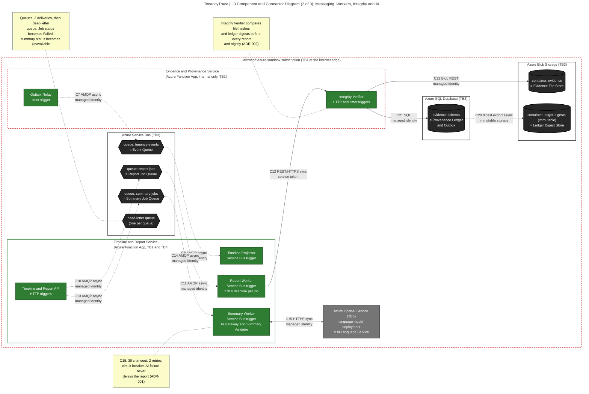

# L3 Component and Connector Diagram (2 of 3): Messaging, Workers, Integrity and AI

```mermaid
---
title: "TenancyTrace | L3 Component and Connector Diagram (2 of 3): Messaging, Workers, Integrity and AI"
config:
  themeVariables:
    fontFamily: Arial
---
flowchart LR
    subgraph AZ["Microsoft Azure sandbox subscription (TB1 at the internet edge)"]
        direction LR
        subgraph FT["Timeline and Report Service<br/>[Azure Function App, TB1 and TB4]"]
            TAPI["Timeline and Report API<br/>HTTP triggers"]:::app
            PROJ["Timeline Projector<br/>Service Bus trigger"]:::app
            RW["Report Worker<br/>Service Bus trigger<br/>270 s deadline per job"]:::app
            SW["Summary Worker<br/>Service Bus trigger<br/>AI Gateway and Summary Validator"]:::app
        end
        subgraph FE["Evidence and Provenance Service<br/>[Azure Function App, internal only, TB2]"]
            ORL["Outbox Relay<br/>timer trigger"]:::app
            IV["Integrity Verifier<br/>HTTP and timer triggers"]:::app
        end
        subgraph SB["Azure Service Bus (TB3)"]
            Q1{{"queue: tenancy-events<br/>= Event Queue"}}:::data
            Q2{{"queue: report-jobs<br/>= Report Job Queue"}}:::data
            Q3{{"queue: summary-jobs<br/>= Summary Job Queue"}}:::data
            DLQ{{"dead-letter queue<br/>(one per queue)"}}:::data
        end
        subgraph SQL["Azure SQL Database (TB3)"]
            SEV[("evidence schema<br/>= Provenance Ledger<br/>and Outbox")]:::data
        end
        subgraph BLOB["Azure Blob Storage (TB3)"]
            BEV[("container: evidence<br/>= Evidence File Store")]:::data
            BDG[("container: ledger-digests (immutable)<br/>= Ledger Digest Store")]:::data
        end
        AOAI["Azure OpenAI Service (TB5)<br/>language model deployment<br/>= AI Language Service"]:::ext
    end

    ORL -.->|"C7 AMQP async<br/>managed identity"| Q1
    Q1 -.->|"C8 AMQP async<br/>managed identity"| PROJ
    TAPI -.->|"C10 AMQP async<br/>managed identity"| Q2
    Q2 -.->|"C11 AMQP async<br/>managed identity"| RW
    RW -->|"C12 REST/HTTPS sync<br/>service token"| IV
    TAPI -.->|"C13 AMQP async<br/>managed identity"| Q3
    Q3 -.->|"C14 AMQP async<br/>managed identity"| SW
    SW <-->|"C15 HTTPS sync<br/>managed identity"| AOAI
    IV -->|"C21 SQL<br/>managed identity"| SEV
    IV -->|"C22 Blob REST<br/>managed identity"| BEV
    SEV -.->|"C20 digest export async<br/>immutable storage"| BDG

    N2["Queues: 3 deliveries, then dead-letter<br/>queue. Job status becomes Failed;<br/>summary status becomes Unavailable"]:::note
    N3["C15: 30 s timeout, 2 retries,<br/>circuit breaker. AI failure never<br/>delays the report (ADR-001)"]:::note
    N4["Integrity Verifier compares file hashes<br/>and ledger digests before every report<br/>and nightly (ADR-002)"]:::note
    N2 -.- DLQ
    N3 -.- SW
    N4 -.- IV

    classDef app fill:#2E7D32,stroke:#1b4d1f,stroke-width:2px,color:#FFFFFF
    classDef data fill:#282728,stroke:#000000,stroke-width:2px,color:#FFFFFF
    classDef ext fill:#757575,stroke:#3a414a,stroke-width:2px,color:#FFFFFF
    classDef note fill:#fcfcca,stroke:#3a414a,color:#000000
    classDef bnd fill:#FFFFFF,stroke:#C62828,stroke-width:2px,stroke-dasharray:6 4,color:#000000
    classDef smp fill:#FFFFFF,stroke:#3a414a,color:#000000
    style AZ fill:#FFFFFF,stroke:#C62828,stroke-width:2px,stroke-dasharray:6 4
    style FT fill:#FFFFFF,stroke:#2E7D32,stroke-width:2px
    style FE fill:#FFFFFF,stroke:#C62828,stroke-width:2px,stroke-dasharray:6 4
    style SQL fill:#FFFFFF,stroke:#282728,stroke-width:2px
    style BLOB fill:#FFFFFF,stroke:#282728,stroke-width:2px
    style SB fill:#FFFFFF,stroke:#282728,stroke-width:2px
```
