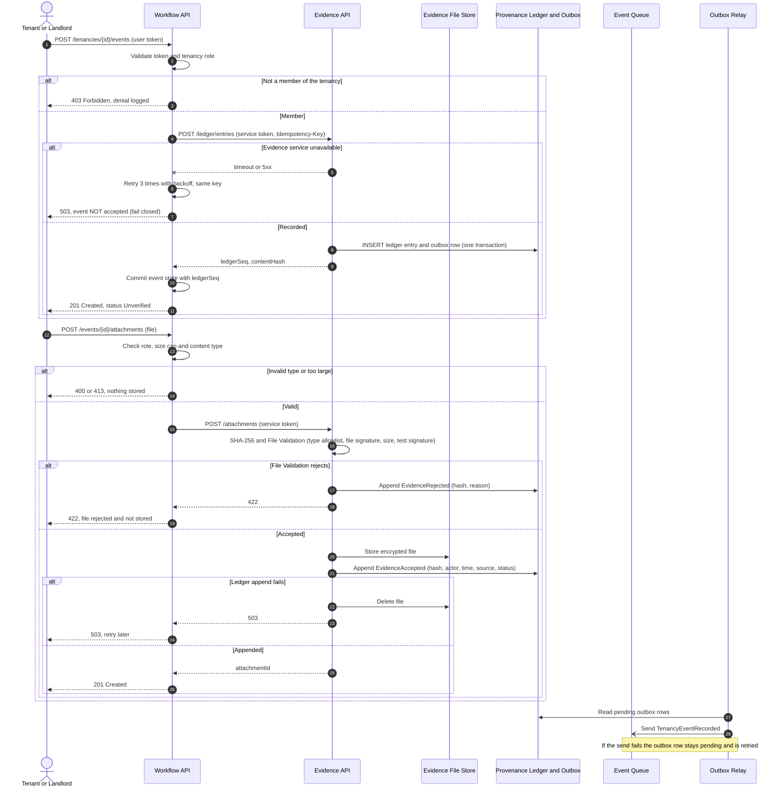

# Process Flow 1 — Record an Event with Evidence

```mermaid
sequenceDiagram
    autonumber
    actor U as Tenant or Landlord
    participant WF as Workflow API
    participant EV as Evidence API
    participant EF as Evidence File Store
    participant LG as Provenance Ledger and Outbox
    participant Q as Event Queue
    participant ORL as Outbox Relay

    U->>WF: POST /tenancies/{id}/events (user token)
    WF->>WF: Validate token and tenancy role
    alt Not a member of the tenancy
        WF-->>U: 403 Forbidden, denial logged
    else Member
        WF->>EV: POST /ledger/entries (service token, Idempotency-Key)
        alt Evidence service unavailable
            EV--xWF: timeout or 5xx
            WF->>WF: Retry 3 times with backoff, same key
            WF-->>U: 503, event NOT accepted (fail closed)
        else Recorded
            EV->>LG: INSERT ledger entry and outbox row (one transaction)
            EV-->>WF: ledgerSeq, contentHash
            WF->>WF: Commit event state with ledgerSeq
            WF-->>U: 201 Created, status Unverified
        end
    end

    U->>WF: POST /events/{id}/attachments (file)
    WF->>WF: Check role, size cap and content type
    alt Invalid type or too large
        WF-->>U: 400 or 413, nothing stored
    else Valid
        WF->>EV: POST /attachments (service token)
        EV->>EV: SHA-256 and File Validation (type allowlist, file signature, size, test signature)
        alt File Validation rejects
            EV->>LG: Append EvidenceRejected (hash, reason)
            EV-->>WF: 422
            WF-->>U: 422, file rejected and not stored
        else Accepted
            EV->>EF: Store encrypted file
            EV->>LG: Append EvidenceAccepted (hash, actor, time, source, status)
            alt Ledger append fails
                EV->>EF: Delete file
                EV-->>WF: 503
                WF-->>U: 503, retry later
            else Appended
                EV-->>WF: attachmentId
                WF-->>U: 201 Created
            end
        end
    end

    ORL->>LG: Read pending outbox rows
    ORL-)Q: Send TenancyEventRecorded
    Note over ORL,Q: If the send fails the outbox row stays pending and is retried
```
