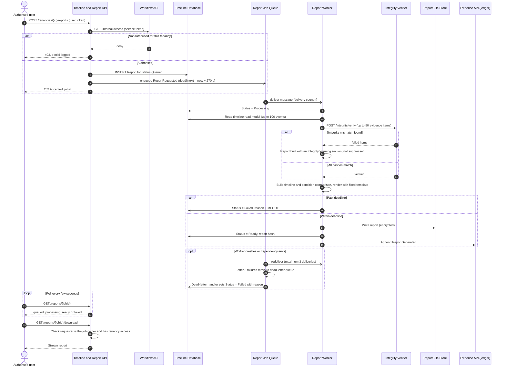

# Process Flow 2 — Generate an Evidence Report

```mermaid
sequenceDiagram
    autonumber
    actor U as Authorised user
    participant TL as Timeline and Report API
    participant WF as Workflow API
    participant DB as Timeline Database
    participant Q as Report Job Queue
    participant RW as Report Worker
    participant EV as Integrity Verifier
    participant RF as Report File Store
    participant LG as Evidence API (ledger)

    U->>TL: POST /tenancies/{id}/reports (user token)
    TL->>WF: GET /internal/access (service token)
    alt Not authorised for this tenancy
        WF-->>TL: deny
        TL-->>U: 403, denial logged
    else Authorised
        TL->>DB: INSERT ReportJob status Queued
        TL-)Q: enqueue ReportRequested (deadlineAt = now + 270 s)
        TL-->>U: 202 Accepted, jobId
    end

    Q-)RW: deliver message (delivery count n)
    RW->>DB: Status = Processing
    RW->>DB: Read timeline read model (up to 100 events)
    RW->>EV: POST /integrity/verify (up to 50 evidence items)
    alt Integrity mismatch found
        EV-->>RW: failed items
        RW->>RW: Report built with an Integrity Warning section, not suppressed
    else All hashes match
        EV-->>RW: verified
    end
    RW->>RW: Build timeline and condition comparison, render with fixed template
    alt Past deadline
        RW->>DB: Status = Failed, reason TIMEOUT
    else Within deadline
        RW->>RF: Write report (encrypted)
        RW->>DB: Status = Ready, report hash
        RW->>LG: Append ReportGenerated
    end

    opt Worker crashes or dependency error
        Q-)RW: redeliver (maximum 3 deliveries)
        Q-->>Q: after 3 failures move to dead-letter queue
        Q-)DB: Dead-letter handler sets Status = Failed with reason
    end

    loop Poll every few seconds
        U->>TL: GET /reports/{jobId}
        TL-->>U: queued, processing, ready or failed
    end
    U->>TL: GET /reports/{jobId}/download
    TL->>TL: Check requester is the job owner and has tenancy access
    TL-->>U: Stream report
```
