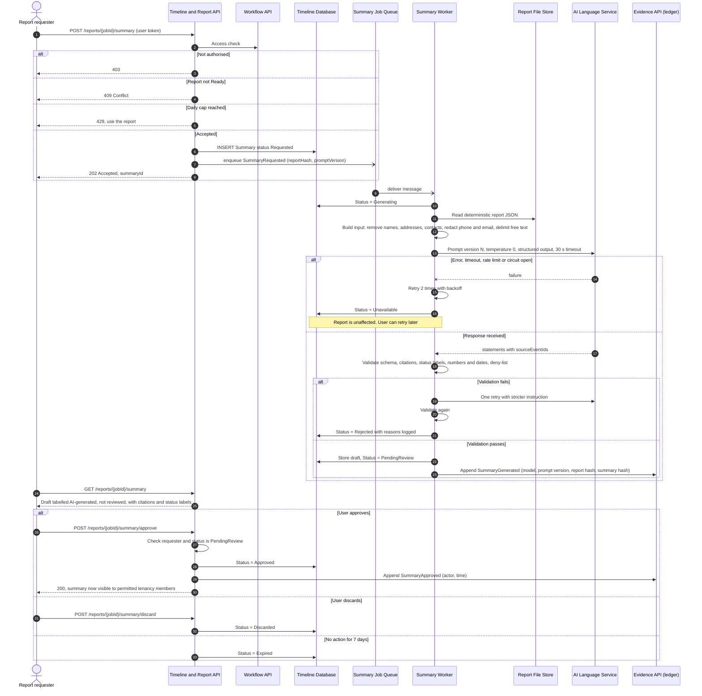

# Process Flow 3 — Generate and Review an AI Summary

```mermaid
sequenceDiagram
    autonumber
    actor U as Report requester
    participant TL as Timeline and Report API
    participant WF as Workflow API
    participant DB as Timeline Database
    participant Q as Summary Job Queue
    participant SW as Summary Worker
    participant RF as Report File Store
    participant AIS as AI Language Service
    participant EV as Evidence API (ledger)

    U->>TL: POST /reports/{jobId}/summary (user token)
    TL->>WF: Access check
    alt Not authorised
        TL-->>U: 403
    else Report not Ready
        TL-->>U: 409 Conflict
    else Daily cap reached
        TL-->>U: 429, use the report
    else Accepted
        TL->>DB: INSERT Summary status Requested
        TL-)Q: enqueue SummaryRequested (reportHash, promptVersion)
        TL-->>U: 202 Accepted, summaryId
    end

    Q-)SW: deliver message
    SW->>DB: Status = Generating
    SW->>RF: Read deterministic report JSON
    SW->>SW: Build input: remove names, addresses, contacts, redact phone and email, delimit free text
    SW->>AIS: Prompt version N, temperature 0, structured output, 30 s timeout
    alt Error, timeout, rate limit or circuit open
        AIS--xSW: failure
        SW->>SW: Retry 2 times with backoff
        SW->>DB: Status = Unavailable
        Note over SW,DB: Report is unaffected. User can retry later
    else Response received
        AIS-->>SW: statements with sourceEventIds
        SW->>SW: Validate schema, citations, status labels, numbers and dates, deny-list
        alt Validation fails
            SW->>AIS: One retry with stricter instruction
            SW->>SW: Validate again
            SW->>DB: Status = Rejected with reasons logged
        else Validation passes
            SW->>DB: Store draft, Status = PendingReview
            SW->>EV: Append SummaryGenerated (model, prompt version, report hash, summary hash)
        end
    end

    U->>TL: GET /reports/{jobId}/summary
    TL-->>U: Draft labelled AI-generated, not reviewed, with citations and status labels
    alt User approves
        U->>TL: POST /reports/{jobId}/summary/approve
        TL->>TL: Check requester and status is PendingReview
        TL->>DB: Status = Approved
        TL->>EV: Append SummaryApproved (actor, time)
        TL-->>U: 200, summary now visible to permitted tenancy members
    else User discards
        U->>TL: POST /reports/{jobId}/summary/discard
        TL->>DB: Status = Discarded
    else No action for 7 days
        TL->>DB: Status = Expired
    end
```
