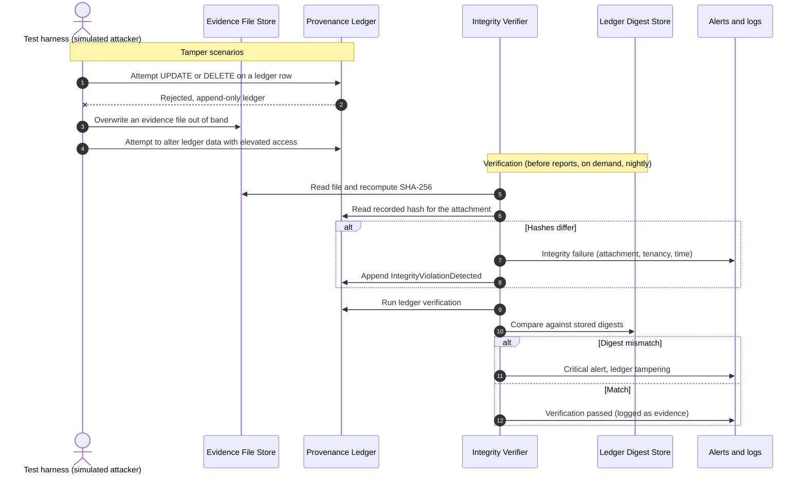

# Process Flow 4 — Detect a Simulated Unauthorised Change

```mermaid
sequenceDiagram
    autonumber
    actor T as Test harness (simulated attacker)
    participant EF as Evidence File Store
    participant LG as Provenance Ledger
    participant EV as Integrity Verifier
    participant DG as Ledger Digest Store
    participant OPS as Alerts and logs

    Note over T,LG: Tamper scenarios
    T->>LG: Attempt UPDATE or DELETE on a ledger row
    LG--xT: Rejected, append-only ledger
    T->>EF: Overwrite an evidence file out of band
    T->>LG: Attempt to alter ledger data with elevated access

    Note over EV,DG: Verification (before reports, on demand, nightly)
    EV->>EF: Read file and recompute SHA-256
    EV->>LG: Read recorded hash for the attachment
    alt Hashes differ
        EV->>OPS: Integrity failure (attachment, tenancy, time)
        EV->>LG: Append IntegrityViolationDetected
    end
    EV->>LG: Run ledger verification
    EV->>DG: Compare against stored digests
    alt Digest mismatch
        EV->>OPS: Critical alert, ledger tampering
    else Match
        EV->>OPS: Verification passed (logged as evidence)
    end
```
