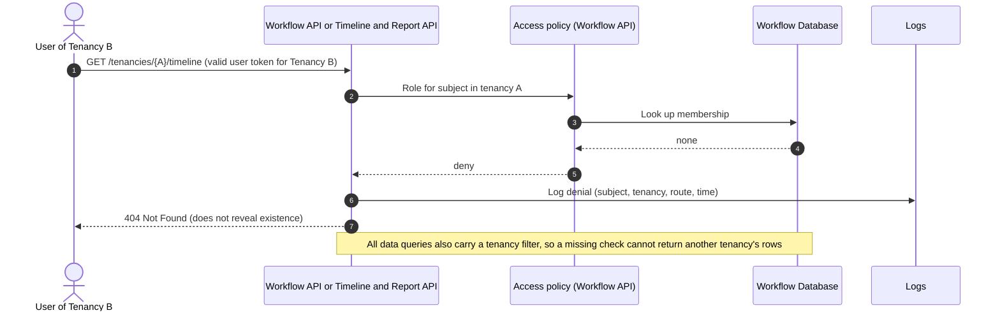

# Process Flow 5 — Block Cross-Tenancy Access

```mermaid
sequenceDiagram
    autonumber
    actor X as User of Tenancy B
    participant API as Workflow API or Timeline and Report API
    participant POL as Access policy (Workflow API)
    participant DB as Workflow Database
    participant OPS as Logs

    X->>API: GET /tenancies/{A}/timeline (valid user token for Tenancy B)
    API->>POL: Role for subject in tenancy A
    POL->>DB: Look up membership
    DB-->>POL: none
    POL-->>API: deny
    API->>OPS: Log denial (subject, tenancy, route, time)
    API-->>X: 404 Not Found (does not reveal existence)
    Note over API,DB: All data queries also carry a tenancy filter, so a missing check cannot return another tenancy's rows
```
