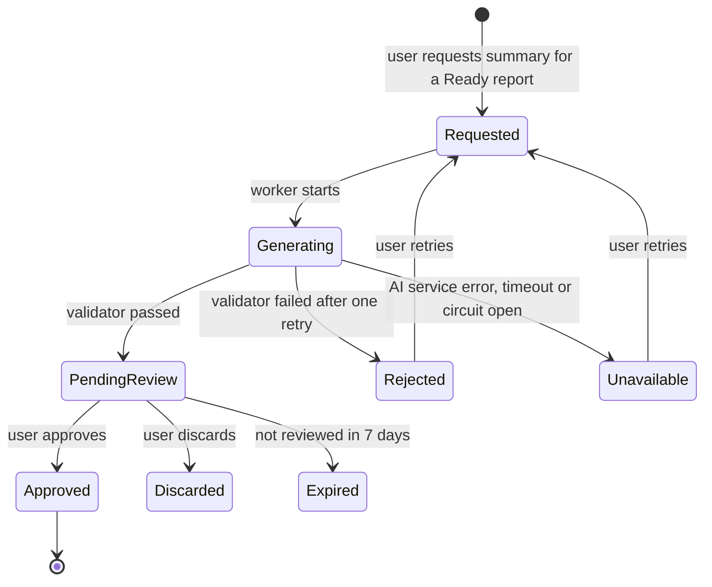

# AI Summary Status Model

```mermaid
stateDiagram-v2
    [*] --> Requested: user requests summary for a Ready report
    Requested --> Generating: worker starts
    Generating --> PendingReview: validator passed
    Generating --> Rejected: validator failed after one retry
    Generating --> Unavailable: AI service error, timeout or circuit open
    PendingReview --> Approved: user approves
    PendingReview --> Discarded: user discards
    PendingReview --> Expired: not reviewed in 7 days
    Rejected --> Requested: user retries
    Unavailable --> Requested: user retries
    Approved --> [*]
```
