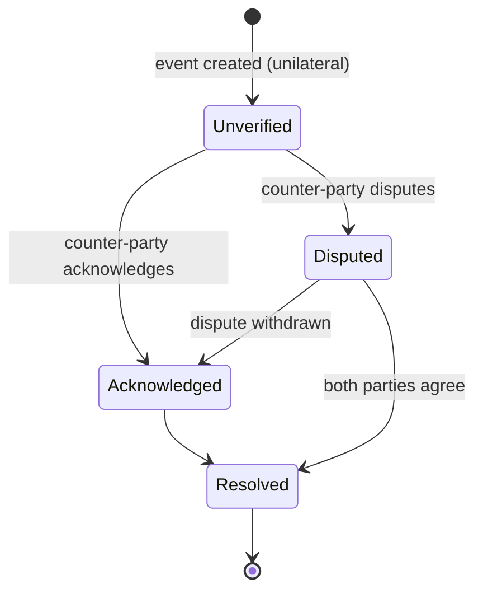

# Event Status Model

```mermaid
stateDiagram-v2
    [*] --> Unverified: event created (unilateral)
    Unverified --> Acknowledged: counter-party acknowledges
    Unverified --> Disputed: counter-party disputes
    Acknowledged --> Resolved
    Disputed --> Resolved: both parties agree
    Disputed --> Acknowledged: dispute withdrawn
    Resolved --> [*]
```
