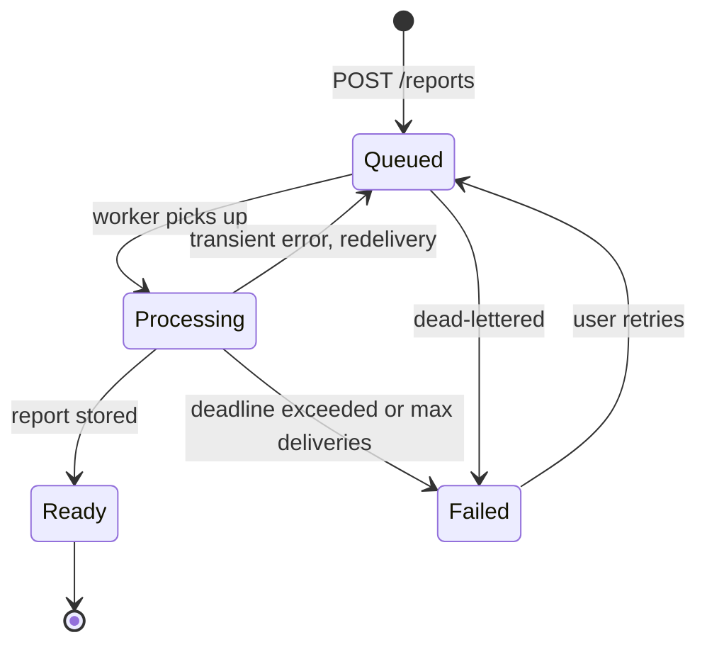

# Report Job Status Model

```mermaid
stateDiagram-v2
    [*] --> Queued: POST /reports
    Queued --> Processing: worker picks up
    Processing --> Ready: report stored
    Processing --> Queued: transient error, redelivery
    Processing --> Failed: deadline exceeded or max deliveries
    Queued --> Failed: dead-lettered
    Failed --> Queued: user retries
    Ready --> [*]
```
